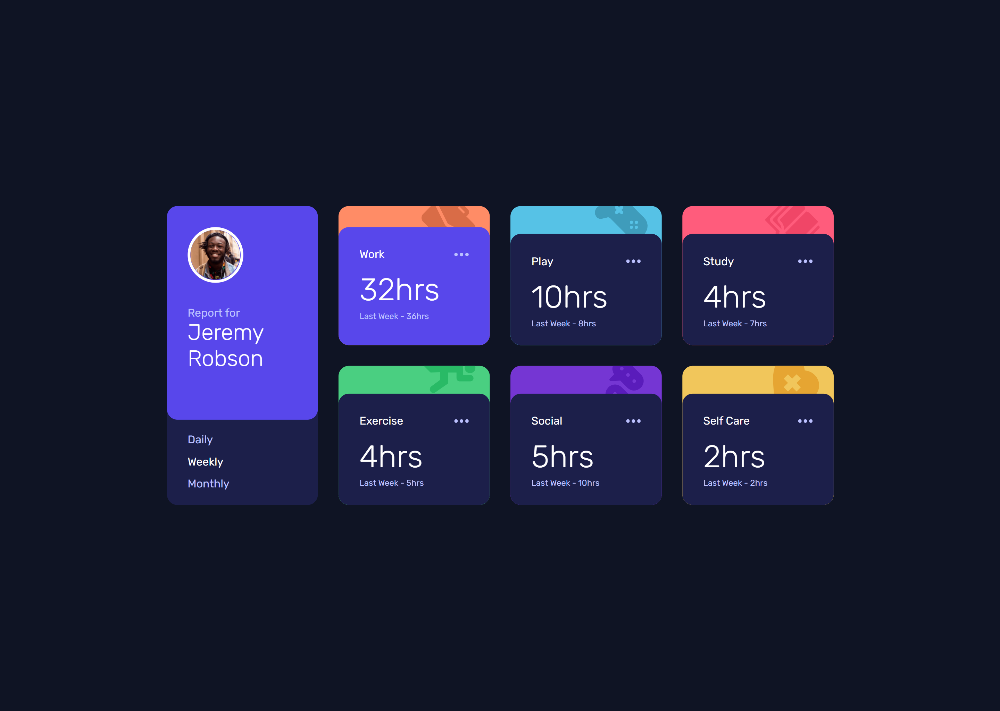
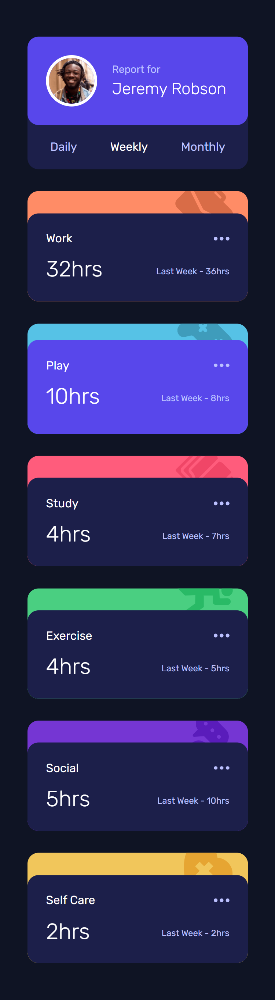

# Frontend Mentor - Time tracking dashboard solution using ReactJS

This is a solution to the [Time tracking dashboard challenge on Frontend Mentor](https://www.frontendmentor.io/challenges/time-tracking-dashboard-UIQ7167Jw). Frontend Mentor challenges help you improve your coding skills by building realistic projects.

## The challenge statement

Your challenge is to build out this dashboard and get it looking as close to the design as possible.

If you would like to practice working with JSON data, we provide a local `data.json` file for the activities. This means you'll be able to pull the data from there instead of using the content in the `.html` file.

Your users should be able to:

- View the optimal layout for the site depending on their device's screen size
- See hover states for all interactive elements on the page
- Switch between viewing Daily, Weekly, and Monthly stats

### Expected behaviour

- The text for the previous period's time should change based on the active timeframe. For Daily, it should read "Yesterday" e.g "Yesterday - 2hrs". For Weekly, it should read "Last Week" e.g. "Last Week - 32hrs". For monthly, it should read "Last Month" e.g. "Last Month - 19hrs".

## Table of contents

## Overview

### Screenshot

Desktop View

Mobile View

### Links

- Solution URL: [Solution](https://www.frontendmentor.io/solutions/faq-accordion-card-ZRNKpuudS)
- Live Site URL: [Live Site](https://sansarj17.github.io/FM-TimeTrackerReact/)

### Built with

- React JS
- React Hooks (useState, useEffect)
- CSS Grid
- CSS Flexbox
- CSS custom properties
- Modern JS(ES6)

## Author

- Github - [@sansarj17](https://github.com/sansarj17/)
- Frontend Mentor - [@sansarj17](https://www.frontendmentor.io/profile/sansarj17)
